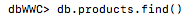

# MongoDB Shell Commands

Table Of Contents | 
---|
[Preface](#preface)| 
[Database](#databases)| 
[Read](#read)|
[Create](#create)|
[Update](#update)|
[Delete](#delete)|
 

## Preface

1. Despues de tener instalado mongoDB y que esté corriendo, se debe instalar mongoDB shell (https://www.mongodb.com/try/download/shell)
2. Abrir la terminal y copiar en la linea de comando `mongosh` para abrir la terminal de mongoDB

## Database

1. Usar el comando `show databases` para que muestre las bases de datos que tenemos disponibles
2. Seleccionar la base de datos `dbWWC` con el comando `use(dbWWC)` 
3. Para trabajar con la base de datos es necesario empezar la consulta con `db` y luego `products` seguido del metodo que quieras usar

## Read
Para ejecutar el comando de leer los productos debes escribir lo siguiente:
1. `db.products.find()` Esta peticion te mostrara todos los productos que estan en la base de datos.
- La peticion 

    
- La respuesta

2. `db.products.find({query})` Esta peticion te mostrara el producto que coincida con el query pasado como parametro.

- La peticion 

- La respuesta

## Create
Para ejecutar el comando de crear un nuevo producto debes escribir lo siguiente:
1. `db.products.create({body})` Esta peticion inserta un body de tipo Json pasado como parametro, no es necesario agregar un campo con el `id` ya que mongoDB lo genera automaticamente

- La peticion

- La respuesta

## Update
Para ejecutar el comando de actualizar un nuevo producto debes escribir lo siguiente:
1. `db.products.updateOne({query},{$set,{key:value}})` Esta peticion recibe dos parametros. El primero es el valor 
- La peticion

- La respuesta

    

## Delete
Para ejecutar el comando de borrar un producto debes escribir lo siguiente:
1. `db.products.deleteOne({query})` A este comando se le debe pasar un parametro de tipo objeto (key:value) que es el valor con el cual sera buscado el producto para luego ser eliminado 
- La peticion

- La respuesta

    